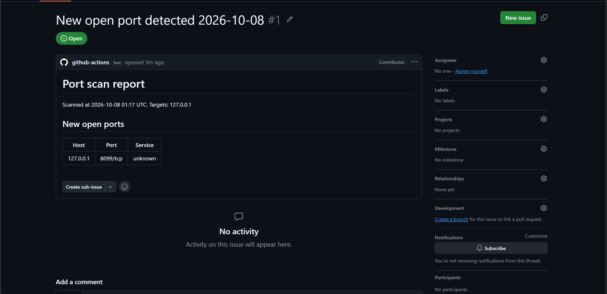

# Scheduled Port Scan with Change Alerts

A small security automation: scan a set of hosts on a schedule, compare the open ports with a saved baseline, and open a GitHub issue only when something new appears.

It replaces a manual routine of running a scan, reading the output, and comparing it by eye with last week's results.

> Only scan systems you own or have written permission to scan. The default target is the CI runner's own localhost.

## How it works

1. `scan.py` runs `nmap` against the hosts in `targets.txt` and parses the XML output.
2. It compares the open ports with `baseline.json` (the first run just saves a baseline).
3. New hosts or new open ports raise an alert. Ports that closed are reported but do not alert.
4. A GitHub Actions workflow (`.github/workflows/scan.yml`) runs this daily, opens an issue with the report when there is an alert, and commits the updated baseline so each change alerts once.

The comparison logic is covered by unit tests (`tests/test_scan.py`), which run in the workflow before every scan.

## Run it locally

Requires Python 3 and [nmap](https://nmap.org/download).

```
python scan.py --targets targets.txt --baseline baseline.json
```

Add `--update-baseline` to overwrite the baseline with the latest scan. Run the tests with `pip install pytest` then `pytest`.

## Run it in GitHub Actions

1. Push this repo to GitHub.
2. Open the **Actions** tab, choose **scheduled-scan**, and click **Run workflow** (leave the demo box unticked). This creates the baseline.
3. Run it again with **demo_port** ticked. The workflow opens a temporary listener on port 8099, the scan finds it as a new open port, and an issue is created.

## Limitations

- It scans with TCP connect scans on a limited port range (`--ports`), so it does not replace a full vulnerability scanner.
- The default target is localhost on the runner, which demonstrates the pipeline but is not a real network. Point `targets.txt` at systems you are authorized to scan.
- Scheduled workflows on public repos are paused by GitHub after 60 days without repository activity.

## Demo run
A manual run with a temporary listener on port 8099 was detected as a new open port, and the workflow opened an issue automatically.

